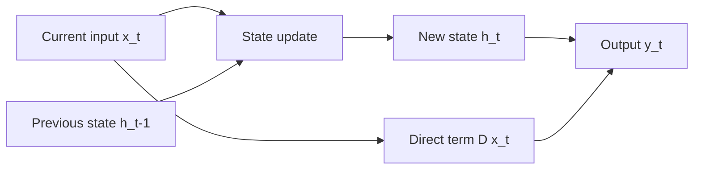
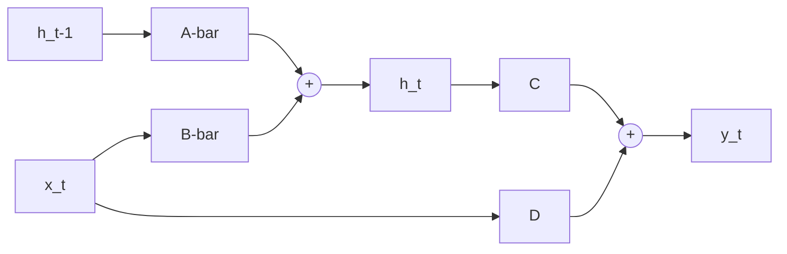
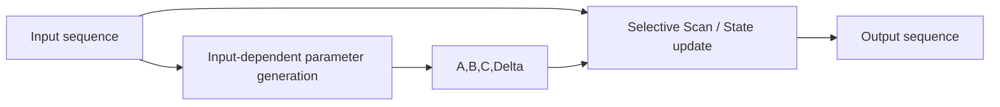

# SSM与Mamba基础学习笔记

这份文档专门用于从基础层面理解：

1. 什么是 `SSM`
2. 什么是 `Mamba`
3. `SSM -> Mamba -> Visual Mamba -> Remote Sensing Mamba` 这条链路是怎么来的
4. 你当前 PPT 里的两张图到底在表达什么
5. Mamba 基本块中的 `SSM` 放在整个结构里起什么作用

本文尽量兼顾两点：

- 讲法要尽量基础、易懂
- 表述要保持学术上基本准确

---

## 1. 先说最核心的一句话

如果只用一句话概括：

> `SSM` 是一种“用内部状态来记忆和更新信息”的序列建模方法，`Mamba` 则是在这个基础上加入“输入相关的动态参数”和“选择性扫描机制”的更灵活版本。

再通俗一点：

- `SSM`：模型会一边看输入，一边更新自己的内部记忆
- `Mamba`：模型不但会记忆，还会根据当前输入动态决定“怎么记、记多少、哪些更重要”

---

## 2. 什么是状态空间模型 SSM

`SSM` 的全称是：

- `State Space Model`
- 中文常译为：状态空间模型

它的核心思想不是“直接把输入变成输出”，而是：

> 在输入和输出之间引入一个“内部状态”

这个内部状态通常记作：

- `h(t)` 或 `h_t`

你可以把它理解为：

- 模型当前的“记忆”
- 模型当前对历史输入的“内部总结”

于是，模型每来一个新输入，不是立刻完全从头做判断，而是：

1. 先参考当前已有状态
2. 再结合新输入更新状态
3. 最后根据状态生成输出

这就是 SSM 的本质。

---

## 3. 为什么要引入“状态”

因为很多任务都不是只看当前输入就够了，而是还要参考前面已经见过的信息。

例如：

- 文本序列：后面的词要参考前面的词
- 时间序列：当前值要参考过去趋势
- 图像展开成序列后：当前 patch 的判断也可能需要参考更远位置
- 高光谱序列：当前波段的解释可能和前后波段有关

所以：

> 如果模型完全没有“记忆”，它就很难建模长程依赖

SSM 就是为了解决这个问题而来的。

---

## 4. 连续时间形式：图 1 左上第一行到底在讲什么

你 PPT 图 1 左边第一行画的是：

- `x(t) -> h(t) -> y(t)`
- 并且从 `h(t)` 旁边歪出一个 `h'(t)`

这一行其实是在表达 **连续时间状态空间模型** 的基本思想。

### 4.1 连续形式的基本公式

最常见写法是：

\[
h'(t) = A h(t) + B x(t)
\]

\[
y(t) = C h(t) + D x(t)
\]

这里每个符号的含义如下：

- `x(t)`：时间 `t` 的输入
- `h(t)`：时间 `t` 的内部状态
- `h'(t)`：状态对时间的变化率，也就是“状态正在怎么变化”
- `y(t)`：输出
- `A`：状态转移矩阵
- `B`：输入如何影响状态
- `C`：状态如何映射到输出
- `D`：输入直接到输出的残差项或直连项

### 4.2 你最困惑的 `h'(t)` 是什么

这里的 `h'(t)` 不是一个新的状态，它表示：

> `h(t)` 随时间变化的“导数”或者“变化速度”

也就是说，图里那个从 `h(t)` 旁边歪出来的 `h'(t)`，是在提醒你：

- `h(t)` 不是静止不变的
- 它会随着输入 `x(t)` 不断演化

所以这张图不是说：

- `h(t)` 变成 `h'(t)` 再变成 `y(t)`

而是在表达：

- 当前系统有一个状态 `h(t)`
- 这个状态本身会按某个动态规律变化，变化规律由 `h'(t)` 描述
- 输出 `y(t)` 则由状态和输入共同决定

### 4.3 这一行图应该怎么读

你可以把第一行读成：

> 在连续时间下，输入 `x(t)` 驱动内部状态 `h(t)` 演化，而状态的演化速度由 `h'(t)` 描述，最终状态再产生输出 `y(t)`。

如果更通俗一点：

> 输入不断影响系统内部记忆，内部记忆本身又在持续变化，最后由这个记忆产生输出。

---

## 5. 离散时间形式：图 1 左边第二行在讲什么

你图里第二行画的是：

- `x_t -> h_t -> h_{t+1} -> y_t`

下面写着：

- `discrete recurrence`

这其实是在讲：

> 把连续时间系统改写成计算机更容易一步一步计算的离散递推形式

### 5.1 为什么要离散化

连续形式里的微分方程在理论上很自然，但在深度学习里，模型训练更适合：

- 按步处理序列
- 一步一步更新状态

所以会把连续系统离散化，得到离散递推形式。

### 5.2 离散形式的基本公式

最常见写法是：

\[
h_t = \bar{A} h_{t-1} + \bar{B} x_t
\]

\[
y_t = C h_t + D x_t
\]

这里：

- `h_{t-1}`：上一步状态
- `x_t`：当前输入
- `h_t`：当前更新后的状态
- `y_t`：当前输出

这和连续形式是同一个思想，只是写成了“按步计算”的形式。

### 5.3 这一行图应该怎么读

你可以读成：

> 当前输入 `x_t` 和上一步状态一起决定新的状态 `h_t`，再由新的状态生成输出；之后状态继续传到下一步，形成递推。

更通俗一点：

> 每一步都拿“旧记忆 + 当前输入”更新成“新记忆”，然后再给出当前结果。

---

## 6. 图 1 左边第三行在讲什么

第三行画的是：

- 一串小块 -> `SSM` -> 一串小块

下面写着：

- `long sequence`

这一行不是在讲新公式，而是在讲：

> SSM 可以被看作一个处理长序列的模块

也就是说：

- 输入是一串序列
- 中间通过 SSM 建模
- 输出仍是一串序列表示

这里想传达的信息是：

> SSM 的价值之一，就是适合较长序列的依赖建模

这也是后面 Mamba 被看重的基础原因之一。

---

## 7. 连续形式和离散形式之间到底是什么关系

你可以这样理解：

- 第一行：理论上的连续动态系统视角
- 第二行：计算机里逐步递推的实现视角
- 第三行：把它抽象成“一个能处理长序列的模块”

所以图 1 左边这三行不是三件不相关的事情，而是：

1. 先从连续动态系统出发
2. 再改写为离散递推形式
3. 最后把它作为一个序列建模模块使用

这是一个“同一思想的三种表达层次”。

---

## 8. 从 SSM 到 Mamba：图 1 中间这块到底在讲什么

你图 1 中间写的是：

- `Mamba`
- `Input-dependent Parameters`
- `Selective Scan`
- 参数写成 `A, B, C, Δ`

这部分是在回答：

> Mamba 和普通 SSM 到底有什么关系？

### 8.1 最关键的关系

最核心的理解是：

> Mamba 不是抛弃 SSM，而是在 SSM 基础上做了增强。

也就是说：

- `SSM` 提供了状态递推和序列建模骨架
- `Mamba` 在这个骨架上，进一步让部分参数随着输入动态变化

### 8.2 为什么要“input-dependent”

传统 SSM 往往更接近“线性时不变系统”：

- 一套参数处理整个序列
- 参数相对固定

这会带来一个问题：

- 不同输入内容其实重要性不同
- 但固定参数不够灵活

所以 Mamba 的关键增强就是：

> 让一部分状态相关参数依赖当前输入来生成

这就是图里 `Input-dependent Parameters` 的意思。

### 8.3 图 1 中间和左边怎么联系

左边讲的是：

- `SSM` 有状态
- 状态按递推更新
- 可以处理长序列

中间讲的是：

- 保留这套状态递推骨架
- 但让参数变得更灵活
- 并引入更高效、更有选择性的扫描计算

所以中间这块可以理解为：

> “升级版 SSM”

不是换路线，而是在原来的状态空间路线之上做了更强的适配。

---

## 9. 什么是 Selective Scan

`Selective Scan` 可以先用一句简单的话理解：

> 它是 Mamba 中执行状态递推的一种高效扫描方式，而且这个扫描过程带有“选择性”。

这里“选择性”的意思不是神秘技巧，而是说：

- 模型不会把所有输入信息都一视同仁
- 它会根据输入内容动态调节状态更新方式

所以图 1 中间可以读成：

> 输入先决定状态相关参数，再由 selective scan 按状态空间方式完成序列建模。

---

## 10. 图 1 右边两块在讲什么

图 1 右边上面写的是：

- `Visual Mamba`
- `SS2D`
- `2D selective scan`

下面写的是：

- `Remote Sensing Mamba`
- HSI + LiDAR -> MSFMamba -> Classification Map

它们是在说明：

> Mamba 这条路线怎么一步一步扩展到视觉和遥感任务

### 10.1 Visual Mamba

原始的状态空间模型和很多 Mamba 表达，最自然的对象是：

- 一维序列

但图像是二维的，所以视觉任务需要一个扩展：

> 把原本的一维扫描思想扩展到二维特征图

这就是 `SS2D` 的含义。

### 10.2 Remote Sensing Mamba

遥感任务比普通视觉更特殊，因为它可能涉及：

- 高光谱
- 多模态
- 高维谱域结构
- 空间与谱域共同建模

所以图右下角是在说明：

> 这条 Mamba 路线最终落地到遥感分类任务中，例如 HSI + LiDAR 的 MSFMamba。

---

## 11. 用 Mermaid 画一个基础 SSM 块

下面我先给一个“概念图版本”的基础 SSM 块。

这个图表达的是：

- 旧状态 `h_{t-1}` 和当前输入 `x_t` 一起更新成新状态 `h_t`
- 新状态再生成输出 `y_t`
- 输入也可能通过一个直连项直接影响输出

如果你想看更“公式化”的版本，也可以这样画：

这对应的是离散公式：

\[
h_t = \bar{A} h_{t-1} + \bar{B} x_t
\]

\[
y_t = C h_t + D x_t
\]

---

## 12. 用 Mermaid 画一个“SSM 到 Mamba”的关系图

这个图对应图 1 中间的意思：

- 输入先决定参数
- 输入也进入扫描过程
- 参数和输入一起决定状态递推与输出

---

## 13. 再专门解释图 1 左边三行

这里专门回答你最困惑的部分。

### 13.1 第一行：`x(t) -> h(t) -> y(t)`，以及 `h'(t)` 到底是什么

这行是连续时间视角。

其中：

- `x(t)`：连续时间输入
- `h(t)`：当前状态
- `y(t)`：当前输出
- `h'(t)`：状态对时间的导数，也就是状态变化率

那个从 `h(t)` 旁边歪出去的 `h'(t)` 箭头，不是在表达一条新的信息流，而是在提示：

> `h(t)` 不是固定值，它会随时间变化，而这种变化规律由 `h'(t)` 描述。

所以你不能把这行看成：

- `x(t)` 先变成 `h(t)`
- 再变成 `h'(t)`
- 再变成 `y(t)`

正确理解是：

- 当前有个状态 `h(t)`
- 这个状态正在演化
- 演化速度由 `h'(t)` 表示
- 输出 `y(t)` 由状态和输入共同决定

### 13.2 第二行：`x_t -> h_t -> h_{t+1} -> y_t`

这行是离散递推视角。

它告诉你：

- 在计算机里不会直接解连续微分方程
- 而是按时间步一步一步更新

这行的重点不是严格的箭头时序，而是“递推”这个概念：

- 当前输入影响当前状态
- 当前状态再传到下一步
- 输出由状态产生

如果讲严谨一点，更准确的时间关系通常是：

- `h_{t-1}` + `x_t` -> `h_t`
- `h_t` -> `y_t`
- `h_t` 再传到下一步形成 `h_{t+1}`

图里为了直观，把它画成了一条链。

### 13.3 第三行：long sequence

这行是在抽象表达：

- SSM 可以拿来处理序列
- 尤其适合较长的序列建模

所以第三行是在把前面理论压缩成“一个序列处理模块”的工程视角。

---

## 14. 图 1 中间和左边到底怎么联系

你可以把它们理解成这三层关系：

### 第一层：左边是“理论基础”

左边告诉你：

- 什么是状态
- 什么是状态演化
- 什么是离散递推
- 为什么它可以做长序列建模

### 第二层：中间是“理论增强”

中间告诉你：

- 保留状态空间模型的骨架
- 让参数和输入相关
- 用 selective scan 来高效执行

### 第三层：右边是“任务扩展”

右边告诉你：

- 这套方法可以扩展到二维视觉
- 还可以进一步扩展到遥感任务

所以整张图是：

> 理论基础 -> 理论增强 -> 视觉扩展 -> 遥感落地

---

## 15. 图 2：Basic Mamba Block 到底在讲什么

图 2 不是在重新解释 SSM 的数学定义，而是在解释：

> 在神经网络模块级别，Mamba 基本块长什么样

它的核心结构可以概括成：

- 一条主分支：`Norm -> Linear -> SSM -> Norm`
- 一条门控分支：`Linear -> SiLU`
- 两支分支做逐元素乘法
- 之后再 `Linear`
- 最后做残差相加

---

## 16. 图 2 的细节怎么理解

### 16.1 输入为什么先到 Norm

这和很多深度学习模块类似：

- 先做归一化
- 让后面的变换更稳定

### 16.2 为什么主分支里有 SSM

因为 Mamba 的核心序列建模能力就在这里。

也就是说：

- 图 1 左边讲的状态空间模型思想
- 在图 2 里具体落在这个 `SSM` 方块上

所以图 2 里的 `SSM` 不是一个普通盒子，它背后正是图 1 左边那套“状态递推”理论。

### 16.3 左边分支为什么是 `Linear + SiLU`

这是门控分支。

它不负责主建模，而负责：

- 对主分支结果做调制

可以理解成：

- 主分支提取“内容”
- 门控分支决定“内容保留多少”

### 16.4 为什么中间是乘法

逐元素乘法表示：

- 用门控值对主分支输出做缩放

这很像一种动态筛选机制。

### 16.5 最后为什么有残差

残差连接有助于：

- 稳定训练
- 保留原输入信息
- 让深层结构更容易优化

---

## 17. 图 2 怎么和图 1 中间联系起来

这是你非常关键要弄明白的一点。

图 1 中间讲的是：

- Mamba 的核心思想：输入相关参数 + selective scan

图 2 讲的是：

- 把这个核心思想封装成一个可堆叠的网络基本块

所以两者关系是：

- 图 1 中间：讲“原理”
- 图 2：讲“模块结构”

你可以把图 2 中间那个 `SSM` 方块理解成：

> 图 1 中间的 `Input-dependent Parameters + Selective Scan` 在网络块里的具体承载位置

也就是说，图 2 里的 `SSM` 并不是“传统静态 SSM”，而是：

> 按 Mamba 思想实现的状态空间建模主分支

---

## 18. 最后把两张图整体串起来

如果你要把两张图讲顺，可以按下面这个顺序：

### 第一步：先讲图 1 左边

说明：

- 什么是状态
- 什么是连续演化
- 什么是离散递推
- 为什么它适合长序列

### 第二步：再讲图 1 中间

说明：

- Mamba 保留了 SSM 骨架
- 但让参数和输入相关
- 并通过 selective scan 更高效、更灵活地执行状态递推

### 第三步：再讲图 1 右边

说明：

- 这套方法可扩展到二维视觉和遥感任务

### 第四步：最后讲图 2

说明：

- 这套思想如何被封装成一个可堆叠的基础块
- 主分支里是状态空间建模
- 旁路里是门控调制
- 最后通过残差形成稳定输出

于是你就能把两张图串成一句完整的话：

> 图 1 说明了从状态空间模型到 Mamba 再到视觉与遥感应用的理论演化；图 2 则进一步展示了这套思想在网络模块层面的基本实现形式，也就是 Mamba block。

---

## 19. 你现在最该牢牢记住的 6 个结论

### 结论 1

`SSM` 的核心不是公式本身，而是：

> 用内部状态来记忆历史，并递推生成输出

### 结论 2

图 1 左上那个 `h'(t)` 表示：

> 状态 `h(t)` 的变化率

不是新的状态节点。

### 结论 3

图 1 左边三行是同一件事的三个层次：

- 连续系统视角
- 离散递推视角
- 长序列模块视角

### 结论 4

`Mamba` 和 `SSM` 的关系不是替代，而是增强：

> Mamba = 更灵活的、输入相关的状态空间建模

### 结论 5

图 2 里的 `SSM` 方块，是图 1 中间原理在网络块里的落地位置。

### 结论 6

Mamba block 的本质可以记成：

> 状态空间主分支 + 门控分支 + 残差连接

---

## 20. 如果你还想继续往下学，下一步最自然是什么

在你现在这个论文语境里，最自然的下一步是继续理解：

1. 为什么 `Visual Mamba` 需要 `SS2D`
2. 为什么 `MSFMamba` 要拆成：
   - `MSpa-Mamba`
   - `Spe-Mamba`
   - `Fus-Mamba`
3. 为什么你的 `Cross-State Modulation` 要切在 `dts / B_s / C_s`

也就是说：

> 你现在已经在“SSM 与 Mamba 基础层”了，下一步就是“二维视觉化”和“遥感任务化”

---

## 21. 用简单例子理解 SSM

前面讲了很多概念和公式，但如果没有例子，容易还是觉得抽象。

所以这一节专门用一些尽量简单、但又合理的例子来理解：

1. `SSM` 到底在“算什么”
2. 为什么说它有“记忆”
3. `Mamba` 比固定参数的 `SSM` 灵活在哪里
4. 二维数据怎么和扫描联系起来

---

## 22. 例子 1：最简单的一维 SSM 递推

我们先不管矩阵，先只看最简单的一维情况。

假设系统状态和输入都是标量，也就是单个数字。

离散形式写成：

\[
h_t = 0.8 h_{t-1} + 0.5 x_t
\]

\[
y_t = h_t
\]

这里我们人为规定：

- 状态保留系数：`0.8`
- 当前输入影响系数：`0.5`
- 输出就直接等于当前状态

### 22.1 给一个输入序列

假设输入序列是：

\[
x_1 = 2,\quad x_2 = 1,\quad x_3 = 3
\]

初始状态设为：

\[
h_0 = 0
\]

### 22.2 一步一步计算

第一步：

\[
h_1 = 0.8 \times 0 + 0.5 \times 2 = 1.0
\]

\[
y_1 = h_1 = 1.0
\]

第二步：

\[
h_2 = 0.8 \times 1.0 + 0.5 \times 1 = 1.3
\]

\[
y_2 = h_2 = 1.3
\]

第三步：

\[
h_3 = 0.8 \times 1.3 + 0.5 \times 3 = 2.54
\]

\[
y_3 = h_3 = 2.54
\]

### 22.3 这个例子说明了什么

这个例子最重要的地方在于：

- `h_2` 不只和 `x_2` 有关
- 它还和 `h_1` 有关
- 而 `h_1` 里已经包含了 `x_1` 的影响

所以：

> 当前输出不仅取决于当前输入，还取决于前面输入留下来的“记忆”

这就是 SSM 的最朴素直觉。

### 22.4 用通俗话理解

你可以把它想成：

- 每来一个新输入，系统先保留一部分旧记忆
- 再加入一部分新输入
- 于是状态一步一步累积起来

这就像：

> 一个人做判断时，不会完全忘掉前面的信息，而是带着前面的印象继续更新自己的判断

---

## 23. 例子 2：如果没有“状态”，会怎样

为了对比，我们假设没有状态记忆，只做最简单的：

\[
y_t = 0.5 x_t
\]

如果输入还是：

\[
x_1 = 2,\quad x_2 = 1,\quad x_3 = 3
\]

那么：

\[
y_1 = 1.0,\quad y_2 = 0.5,\quad y_3 = 1.5
\]

你会发现：

- 每一步只看当前输入
- 完全没有利用前面信息

和刚才 SSM 的结果对比：

- 无状态时：`1.0, 0.5, 1.5`
- 有状态时：`1.0, 1.3, 2.54`

差别就在于：

> SSM 会积累历史信息，而普通逐点映射不会

---

## 24. 例子 3：A、B、C、D 在最简单情况下怎么理解

前面公式里一直有：

\[
h_t = \bar{A} h_{t-1} + \bar{B} x_t
\]

\[
y_t = C h_t + D x_t
\]

你可以用一个最简单的数字例子来理解：

假设：

- `A = 0.8`
- `B = 0.5`
- `C = 1.2`
- `D = 0.1`

那么公式变成：

\[
h_t = 0.8 h_{t-1} + 0.5 x_t
\]

\[
y_t = 1.2 h_t + 0.1 x_t
\]

如果还是第一步，`h_0 = 0, x_1 = 2`

先算状态：

\[
h_1 = 0.8 \times 0 + 0.5 \times 2 = 1.0
\]

再算输出：

\[
y_1 = 1.2 \times 1.0 + 0.1 \times 2 = 1.4
\]

### 24.1 这四个量的通俗理解

- `A`：旧状态保留多少
- `B`：新输入写进状态的力度
- `C`：状态对输出的影响有多大
- `D`：输入有没有直接影响输出的捷径

所以可以粗略理解成：

> `A` 管记忆保留，`B` 管新信息写入，`C` 管记忆怎么读出来，`D` 管输入是否直接参与输出

---

## 25. 例子 4：为什么说 SSM 适合“长序列”

我们来想一个很简单的实际场景：

### 场景

假设你在看一个人的心电信号或某个传感器时间序列：

\[
1,\ 1,\ 1,\ 5,\ 1,\ 1
\]

其中中间那个 `5` 是一个异常峰值。

如果你只看当前点，很容易只能知道：

- 当前是大还是小

但如果你有状态记忆，你可以知道：

- 前面一直都稳定在 1
- 突然跳到 5
- 这是一个明显偏离历史模式的变化

这说明：

> 只有把当前输入放到“历史背景”里看，很多模式才更容易识别

而 SSM 恰好就是做这件事的。

---

## 26. 例子 5：最简单的“二维数据展开成序列”

你现在论文里会遇到视觉和遥感，所以还要理解：

> 为什么二维图像也能和 SSM 扯上关系

我们先看一个极小的 2×2 矩阵：

\[
X =
\begin{bmatrix}
1 & 2 \\
3 & 4
\end{bmatrix}
\]

如果按“从左到右、从上到下”展开成序列：

\[
[1, 2, 3, 4]
\]

那么这个二维图像块就被转换成了一个一维序列。

于是 SSM 就可以拿来处理这个序列。

### 26.1 一个最简单的扫描例子

仍然用：

\[
h_t = 0.5 h_{t-1} + x_t
\]

初始状态：

\[
h_0 = 0
\]

输入序列：

\[
x_1 = 1,\ x_2 = 2,\ x_3 = 3,\ x_4 = 4
\]

逐步计算：

\[
h_1 = 0.5 \times 0 + 1 = 1
\]

\[
h_2 = 0.5 \times 1 + 2 = 2.5
\]

\[
h_3 = 0.5 \times 2.5 + 3 = 4.25
\]

\[
h_4 = 0.5 \times 4.25 + 4 = 6.125
\]

这就表示：

- 后面的格子状态，不只看当前值
- 还携带了前面格子的信息

### 26.2 这和视觉任务有什么关系

这说明一个基本事实：

> 只要你能把二维特征图组织成序列，就可以把状态空间建模思想搬过来

当然，真正的视觉 Mamba 没这么简单，它会考虑：

- 多方向扫描
- 二维结构保留
- 更复杂的参数生成

但最基础的直觉就是这个。

---

## 27. 例子 6：为什么视觉任务常常需要“多方向扫描”

还是用一个简单 2×2 例子：

\[
X =
\begin{bmatrix}
1 & 2 \\
3 & 4
\end{bmatrix}
\]

如果你只按一种顺序扫描，比如：

\[
[1, 2, 3, 4]
\]

那么位置 `4` 会收到前面 `1,2,3` 的累积影响；
但位置 `1` 就收不到后面的信息。

如果反向再扫一次：

\[
[4, 3, 2, 1]
\]

那么原来开头的元素，也能“看到”另一方向的信息。

所以多方向扫描的直觉是：

> 单方向扫描的信息传播有方向偏置，多方向扫描可以减弱这种偏置

这也是后面 `Visual Mamba`、`MSpa-Mamba` 等结构里经常会看到多路径或多方向序列的原因。

---

## 28. 例子 7：固定参数的 SSM 和 Mamba 有什么区别

前面的一维例子里，我们一直默认参数固定，比如：

\[
h_t = 0.8 h_{t-1} + 0.5 x_t
\]

这意味着：

- 不管当前输入是大是小
- 不管当前内容重要不重要
- 系统总是按同一套规则更新状态

这就是“固定参数”的直觉。

### 28.1 一个简单对比

假设我们有两个输入：

- 情况 A：`x_t = 0.1`
- 情况 B：`x_t = 10`

如果固定参数：

\[
h_t = 0.8 h_{t-1} + 0.5 x_t
\]

那么两种情况都只能按：

- 旧状态乘 0.8
- 输入乘 0.5

来处理。

但在很多真实任务里，我们其实希望：

- 对不重要的小输入，更新得温和一些
- 对关键的大输入，更新得更明显一些

### 28.2 Mamba 的直觉版本

Mamba 的思路就是：

> 让参数不必完全固定，而是能根据当前输入动态调整

例如你可以想象成：

\[
h_t = a(x_t)\, h_{t-1} + b(x_t)\, x_t
\]

这里：

- `a(x_t)`：根据当前输入决定旧状态保留多少
- `b(x_t)`：根据当前输入决定新输入写入多少

这就是“input-dependent parameters”的最朴素直觉。

注意：

- 这只是帮助理解的写法
- 不是在严格复现论文中的全部细节

### 28.3 举一个具体的假想例子

假设我们人为规定：

当 `x_t` 很小：

- `a = 0.9`
- `b = 0.2`

当 `x_t` 很大：

- `a = 0.6`
- `b = 0.8`

再假设当前旧状态：

\[
h_{t-1} = 2
\]

#### 情况 A：`x_t = 0.1`

\[
h_t = 0.9 \times 2 + 0.2 \times 0.1 = 1.82
\]

说明：

- 大部分保留旧状态
- 新输入影响较小

#### 情况 B：`x_t = 10`

\[
h_t = 0.6 \times 2 + 0.8 \times 10 = 9.2
\]

说明：

- 旧状态保留减少
- 当前输入强烈写入

### 28.4 这个例子说明了什么

它说明：

> Mamba 比固定 SSM 更灵活，因为它允许模型根据当前输入内容动态调整状态更新策略。

这就是为什么图 1 中间会强调：

- `Input-dependent Parameters`

---

## 29. 例子 8：把“Selective”理解成“不是所有输入都同样重要”

假设你在读一个序列：

\[
[0,\ 0,\ 10,\ 0,\ 0]
\]

如果模型完全平均看待所有输入，那么中间那个 `10` 的特殊意义不一定会被充分体现。

但如果模型可以根据输入动态调整更新强度，就可能出现：

- 读到 `0` 时，轻微更新
- 读到 `10` 时，强烈更新

这就是“选择性”的直觉：

> 对不同内容，不采用完全同样的状态更新方式

在真实 Mamba 里，这种“选择性”当然不是靠手工规则，而是通过可学习的输入依赖参数实现的。

---

## 30. 例子 9：高光谱谱域建模的直觉例子

你论文里不只是普通序列，还有高光谱。

假设一个像素在 4 个波段上的响应是：

\[
[0.2,\ 0.25,\ 0.8,\ 0.85]
\]

另一个像素是：

\[
[0.2,\ 0.22,\ 0.3,\ 0.35]
\]

如果你只单独看每个波段，可能不容易直观看出差别；
但如果把整个波段序列连起来看，就会发现：

- 第一个像素在后两个波段有明显跃升
- 第二个像素则整体更平缓

这说明：

> 高光谱的关键不只是“单个波段值”，而是“波段之间的连续关系”

于是你就能理解为什么：

- `Spe-Mamba` 会把通道维度展开成序列
- 再用状态空间模型去建模谱域依赖

---

## 31. 例子 10：双模态融合里为什么“状态级调制”比拼接更深

假设你有两个模态：

- 模态 A：高光谱信息
- 模态 B：LiDAR 高度信息

### 31.1 最浅层的融合

把它们直接拼起来：

\[
[A, B]
\]

这只是：

> 把两份信息并排交给后续模块

### 31.2 更深一点的状态级融合

如果让模态 A 不只是并排提供信息，而是去影响模态 B 的状态更新参数，那就变成：

\[
h_t = a(A)\, h_{t-1} + b(A)\, x_t^{(B)}
\]

这时模态 A 不再只是“给特征”，而是在影响：

- 旧状态保留多少
- 新输入写入多少

所以这就比拼接更深，因为：

> A 已经在影响 B “怎么被建模”，而不只是和 B 放在一起

这也正是你后面 `Cross-State Modulation` 想做的事情。

---

## 32. 一个小总结：通过例子你应该抓住什么

看完这些例子，你最应该抓住的不是每一个数字，而是下面几个直觉：

### 直觉 1

`SSM` 的本质是：

> 旧状态 + 当前输入 -> 新状态 -> 输出

### 直觉 2

“状态”就是：

> 对历史信息的内部记忆

### 直觉 3

二维图像也能用 SSM 思想，是因为：

> 可以把二维数据组织成可扫描序列

### 直觉 4

`Mamba` 比固定 `SSM` 更灵活，是因为：

> 它允许状态更新参数根据当前输入动态变化

### 直觉 5

“Selective” 的直觉就是：

> 不同输入内容，不采用完全一样的状态更新方式

### 直觉 6

状态级融合更深，是因为：

> 一个模态开始影响另一个模态“怎么更新状态”

---

## 33. 你现在如果还想继续深一层，最适合追问什么

如果你看完这一节，下一步最值得继续问的问题通常是：

1. `Selective Scan` 在 Mamba 里到底如何计算
2. `SS2D` 怎么把二维特征组织成多方向扫描
3. 为什么 `MSpa-Mamba` 和 `Spe-Mamba` 都保留了 Mamba block 的骨架
4. 为什么你的 `Cross-State Modulation` 只调 `dts / B_s / C_s`

也就是说：

> 现在你已经能从“例子直觉”理解 SSM 和 Mamba，下一步就可以进入“和你论文结构直接对应”的那一层了。
